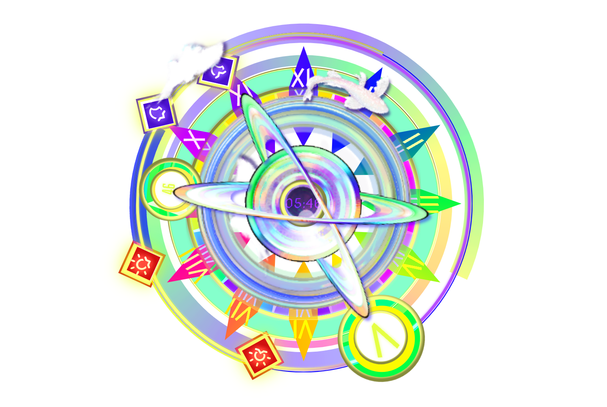
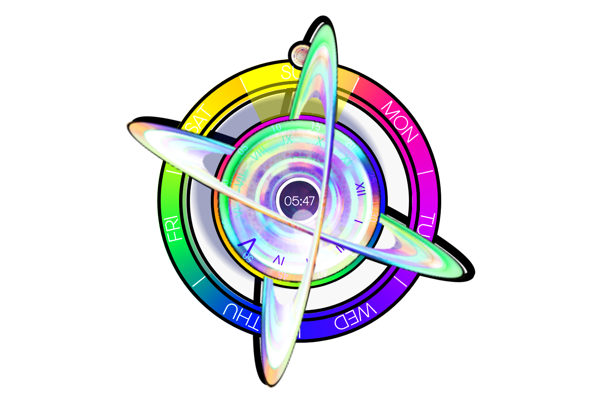
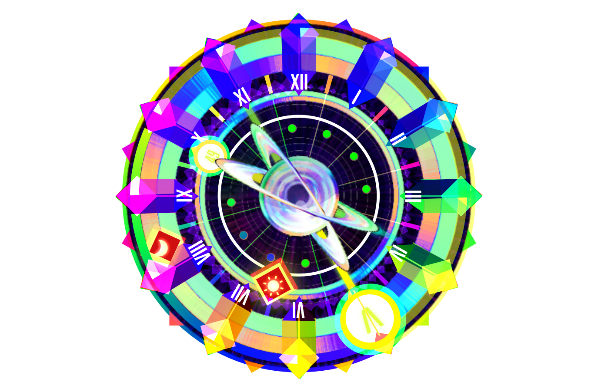

# TimeCrystals KWGT

Violently bright & garish KWGT clocks ✨

## Previews

| TimeCrystals 1 | TimeCrystals 2 | TimeCrystals 3 |
|---|---|---|
|  |  |  |

Super messy kwgt files I've been massaging for the past few years now. The main clock includes indicators for sunrise & moonrise (the red diamonds), inner cloud tracks time / total for the day, fish circles on the hour, outer cloud circles on the hour too but is still named WhereInHourFish 😅 Ive forgotten quite a few of the others... (Literally as I typed this I forgot if I had done Sunrise and Moonrise or Sunset, realized at some point I lost my Moon markers, went & added em, and re-exported & re-captured the demo 😅)
I never planned a polished release; there's a lot of unused globals, alongside a handful of failed calculations (that I figured still looked pretty neat, so decided to keep) and Dont Get Me Started on Naming (seriously please dont the naming interface makes multiple parts of my soul cry 😆😭😅) 

Only & all art assets (planet, rings, fish, cloud, etc) are my own doodling, everything else is made with built-in kwgt things. 
Nothing aganst AI as a tool (& I plan to clean & refine this with it eventually) but as of now, I can say this is all human-crafted  human-tinkered & human-fussed. Figured it'd be nice to share somewhere before it becomes much easier to just say I AI'd it. And indulge in the garrish & violently bright :)

TLDR personal project ive been fiddling with, not meant to be a polished release so don't expect polish pls & thx 🩷

## Download

Grab the current `.kwgt` files / complete pack from the **[Releases](https://github.com/BirdMachine/TimeCrystals-KWGT/releases)** page.

## Included presets

- `TimeCrystals_1.kwgt`
- `TimeCrystals_2.kwgt`
- `TimeCrystals_3.kwgt`

